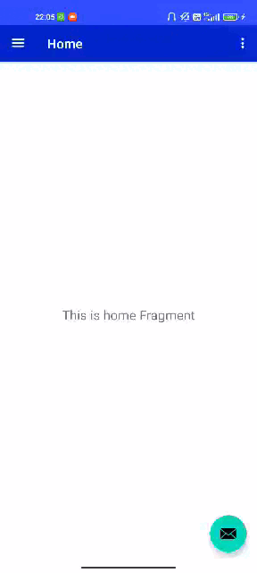

# BoatApp

Application Android pour un bateau de croisière.

Crée par Riabi Jasmine, Pettegola Loïs et Festoc Mylan.


[](http://kotlinlang.org)


# BOAT APP

<p align="center">
  
</p>

A BOAT APP in _Android_ with _kotlin_.

Création d'un menu avec toutes les activités à bord du bateau: Restaurants, Escales, Activités, Shopping, Infos et Actualités.
Notre sujet est de créer la liste des escales de la croisière, donc créer une liste cliquable avec des images, des villes où il y aurait une escales ainsi que les dates ; et lors du clique sur ces villes, on renverrait une notification de type _Toast_ avec la ville de l'escale.




## Pour commencer

Ceci est un projet _Android_ créer avec le langage _Kotlin_.

### Prérequis

Installer [Android Studio](https://developer.android.com/studio)

### Installation

1. Clone le repo
   ```sh
   git clone https://github.com/jasmine-riabi/BoatApp
   ```

## Dependencies en plus
  * Recyclerview

### Fonctionnalités utilisées
  * [View Binding, Part of Android Jetpack](https://developer.android.com/topic/libraries/view-binding)
  * [RecyclerView, Part of Android Jetpack](https://developer.android.com/jetpack/androidx/releases/recyclerview)

## License

Distributed under the GNU General Public License v3.0. See [LICENSE](https://github.com/jasmine-riabi/BoatApp/blob/master/LICENSE) for more information (cf. [Choose an open source license](https://choosealicense.com/)).

